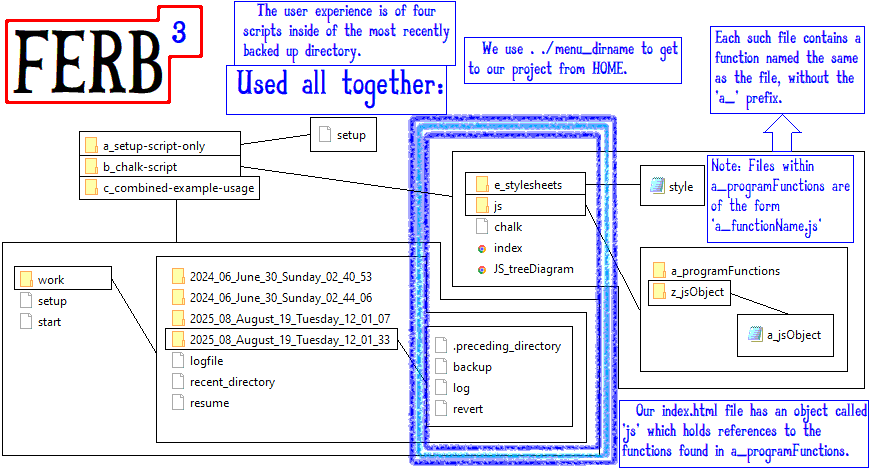

# Front-End Revert Backup and Build with BASH

A simple solution for local control for front-end web development projects.

Designed specifically for managing small to medium sized projects using BASH scripts. 

[HW HTML Drafting Project](https://github.com/dckimMysteryAuthor/HW-HTML-Drafting-Project) is an example of an Open-Source Project which made use of this system. It is clear that with a few minor adaptations, the system of scripts can be utilized in many cases, with myriad benefits, and still function along-side GIT.

This is not designed as a replacement for GIT by any means. A possible workflow might be: Make changes locally, and make backups locally at will. This way the safety of a complete backup is available locally without needing to rely completely on GIT for recovery after a potentially bad local change. This should promote a more free atmosphere within the local context, and improve control and quality of final commits made through git.

You are just a few tweaks and maybe one script away from possibly aligning this system with a scripted transfer to the local GIT repository.

Whether you choose to work from within the latest chronologically named directory, or write a script to maintain a constant top working directory: That's completely up to you.

## For anyone who is kinda new to web development and has just discovered this:

The struggle is over, and the easy part is now here. You can backup at any time, so you will never step back from the progress you have made. The revert will only take you back a single step but, you can always change into an earlier directory manually and then use the backup script that is inside of that directory. Then that one becomes the top. **Good To Go**.

## As for me? I like it just how it is.

I might change it around a little to see if it can be even better but, you never know how good something is until you try something else and it's bad.

# Here is a diagram

This still might seem somewhat complex, and so I will now describe the structure of the files, and how the user will perceive this in daily work.

There are three directories shown in the diagram labelled 'abc'.

This explanation will focus on the **combined example usage**. First I will tell about the script named 'setup'. This is a BASH script which must be first placed in the intended project's directory, then it must be run by typing '. ./setup'

This will build the basic backup/revert system and the starter folders. We will then be brought into the folder with the latest date, where I recommend that an initial backup be performed by typing '. ./backup'

For information: The revert script will be access the same way as the others, and will only allow us to be brought back one step. If we wish to revert further than one step, we must manually change directories and then use the backup script from the desired directory. Then that directory will become the latest directory.

-dckimGUY
